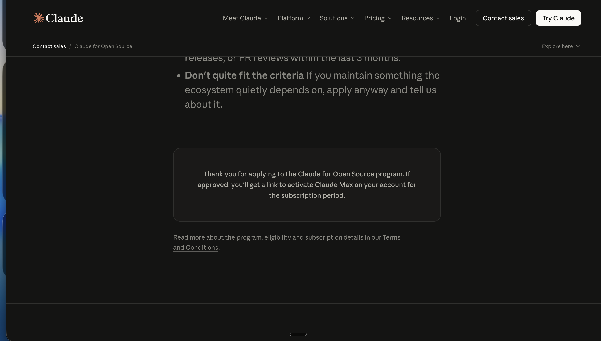

# WorldView
World View is a powerful, real-time global monitoring platform that visualizes live activity across the planet — from aircraft and maritime traffic to geopolitical events and financial markets — all in one unified interface.
World View — Real-Time Global Intelligence Platform

A powerful platform to visualize live global activity — flights, ships, markets, and events — in one unified dashboard.

✨ Overview

World View is a real-time global monitoring system that combines live data, interactive maps, and AI insights into a single interface.

It is designed to function like a next-generation intelligence terminal, helping users track and understand what’s happening across the world instantly.

🚀 Features
🌐 2D + 3D Map
Toggle between flat map and 3D globe
Smooth and fast rendering
✈️ Live Flight Tracking
Real-time aircraft positions
Flight data: speed, altitude, routes
🚢 Ship Tracking (AIS)
Track up to 500,000+ vessels
Global maritime routes and movements
📊 Market Data
Stocks, indices, and economic indicators
🧠 AI Insights
Smart summaries of global activity
⚡ Real-Time System
WebSocket-based backend
Fast, scalable updates
🎛️ Filters & Controls
Filter by region, type, and activity
🛠️ Tech Stack

Frontend

React / Next.js
Tailwind CSS
Globe.gl / Mapbox

Backend

Node.js
Express
WebSockets

APIs

Aviation APIs
AIS Stream
Financial APIs
AI APIs

Backend structure:

package.json — all deps, scripts
docker-compose.yml + Dockerfile
.env.example — all API keys documented
src/config/index.js — centralized config
src/utils/logger.js — Winston logging
src/utils/normalize.js — unified data format for all types
src/cache/index.js — Redis + memory fallback
src/services/flights.js — OpenSky real-time
src/services/ships.js — AIS Stream WebSocket (unlimited ships)
src/services/news.js — GNews + geolocation
src/services/stocks.js — Twelve Data + Yahoo Finance (Indian + global)
src/services/crypto.js — CoinGecko
src/services/earthquakes.js — USGS real-time
src/services/geopolitical.js — 17 conflict zones + threat scoring
src/services/weather.js — OpenWeather 15 cities
src/sockets/index.js — Socket.io broadcaster
src/routes/api.js — all REST endpoints

## 📸 Screenshots

